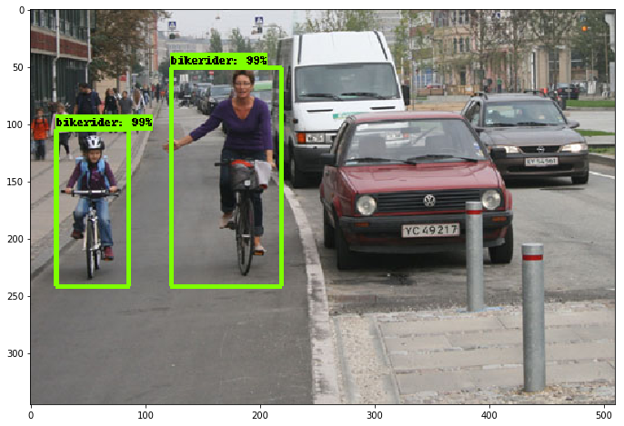
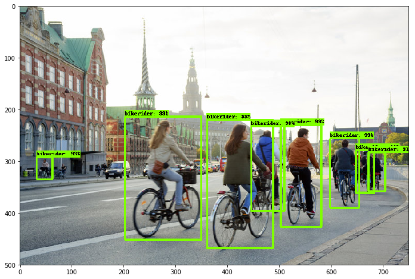
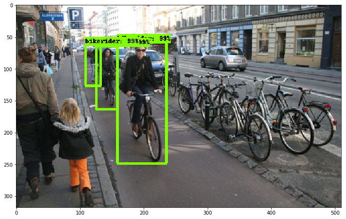

Bike-rider Detector
==============================

This repository illustrates how to create a bike-rider detector using Tensorflow so that we can use the detector to count the number of bike-riders in the street.



## Overview

1. Collect images of bike-riders from Google and Pixabay.
2. Label them with [LabelImg](https://github.com/tzutalin/labelImg)
3. Transfer learning from existing network using Tensorflow
4. Result

In general, this repository's codes are largely adopted from the posting below:
https://towardsdatascience.com/how-to-train-your-own-object-detector-with-tensorflows-object-detector-api-bec72ecfe1d9


## Data Collection

I collected total 396 images with bike riders, 324 from Google image search and 72 from Pixabay. You can see the images in the data/training/image folder. Don't forget resize the scraped images before labeling. You can use resize_images.py under src folder. 

## Labeling

Then I annotated the region of bike riders in each image with [LabelImg](https://github.com/tzutalin/labelImg) tool, which makes to labeling process much convenient. I assigned 'bikerider' label on bike riders. You can find annotations for each image under data/training/annotation.

## Create dataset

1. Split train and test dataset
  - use split_train_test.py under src
  ```
   python split_train_test.py --test_ratio=0.3
  ```
  - this will create csv files (train_labels.csv, test_labels.csv) under ../data/training/data
  
2. Convert the two dataset into tfrecord format
  - use generate_tfrecord.py under src
  ```
    python generate_tfrecord.py \
      --csv_input=../data/training/data/train_labels.csv \
      --output_path=../data/training/data/train.record

    python generate_tfrecord.py \
        --csv_input=../data/training/data/test_labels.csv \
        --output_path=../data/training/data/test.record
  ```  

## Transfer learning

We are going to use Tensorflow Object Detection API to train a detector. See [here](https://github.com/tensorflow/models/tree/master/research/object_detection) to set up it.

Instead of training the detector from scratch, I used faster_rcnn_resnet101_coco as basis. Modify the path of the ckpt file accordingly in data/training/config/faster_rcnn_resnet101_coco.config (line 112). You may need to change the path of train.record, test.record, and object-detection.pbtxt at line 127, 129, 141, 143 as well.

Then run train.py of object detection api (change path accordingly).
```
# move to your tensorflow object detection directory
cd ~/repo/tensorflow/models/research
# change parameters accordingly
python object_detection/train.py \
--logtostderr \
--pipeline_config_path=/home/ubuntu/repo/bike-detector/data/training/config/faster_rcnn_resnet101_coco.config \
--train_dir=/home/ubuntu/repo/bike-detector/data/training/train
```
It took me ~3 hours with Amazon AWS p2.xlarge instance.

## Result
Once training is done, you can use the trained network to detect bike riders. See the notebook:
https://github.com/yonghah/bikerider-detector/blob/master/notebook/test-bikerider-detector.ipynb




You can download trained network from here: 
https://umich.box.com/s/ncqywd2d8nfahzt1nmz6e2218q61mmad
